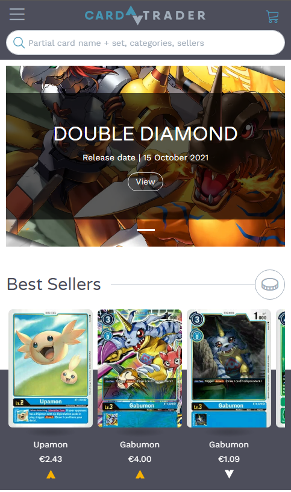
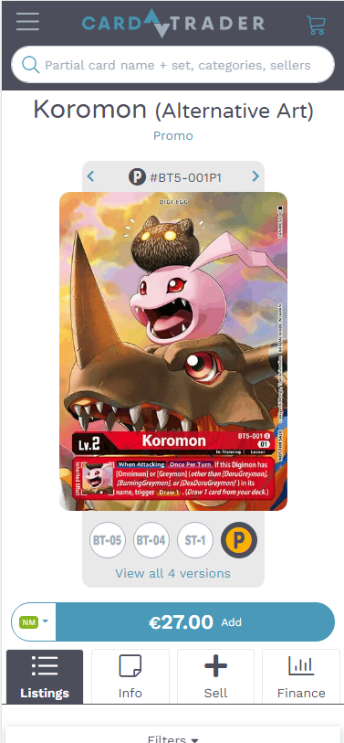
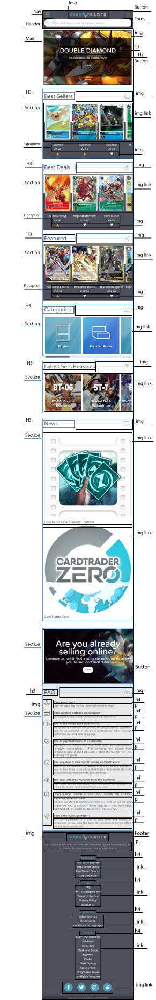
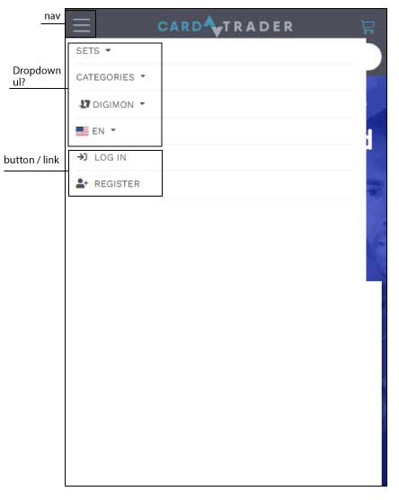
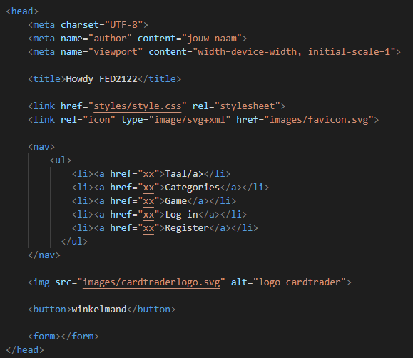
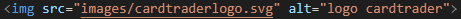
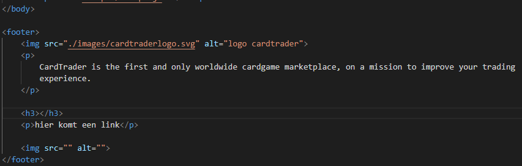

# Procesverslag
Markdown is een simpele manier om HTML te schrijven.  
Markdown cheat cheet: [Hulp bij het schrijven van Markdown](https://github.com/adam-p/markdown-here/wiki/Markdown-Cheatsheet).

Nb. De standaardstructuur en de spartaanse opmaak van de README.md zijn helemaal prima. Het gaat om de inhoud van je procesverslag. Besteedt de tijd voor pracht en praal aan je website.

Nb. Door *open* toe te voegen aan een *details* element kun je deze standaard open zetten. Fijn om dat steeds voor de relevante stuk(ken) te doen.

## Jij

uitwerken voor kick-off werkgroep

### Auteur:
Balinh Khoang

#### Je startniveau:
Rode piste

#### Je focus:
Responsive
 

## Je website

uitwerken voor kick-off werkgroep

### Je opdracht:
https://www.cardtrader.com/en 

#### Screenshot(s) van de eerste pagina (small screen): 
Homepage 

#### Screenshot(s) van de tweede pagina (small screen):
itemlisting

 

## Breakdownschets (week 1)

uitwerken na afloop 2e werkgroep

### de hele pagina: 

### dynamisch deel (bijv menu): 

### wellicht nog een dynamisch deel (bijv filter): 

## Voortgang 1 (week 2)

uitwerken voor 1e voortgang

### Stand van zaken
hier dit ging goed & dit was lastig (neem ook screenshots op van delen van je website en code)

In verband met omstandigheden, liep ik achter met de code. Verder klopte sommige delen van de code niet. 

### Agenda voor meeting
samen met je groepje opstellen

| student 1      | student 2          | student 3    | student 4        |
| ---            | ---                | ---          | ---              |
| dit bespreken  | en dit             | en ik dit    | en dan ik dat    |
| en dat ook nog | dit als er tijd is | nog een punt | dit wil ik zeker |
| ...            | ...                | ...          | ...              |

### Verslag van meeting
hier na afloop snel de uitkomsten van de meeting vastleggen

- Alles moet in de body worden geschreven
- Header en footer moet in de body
- Head verward met de header
- Figcaption moet in een figure

## Voortgang 2 (week 3)

uitwerken voor 2e voortgang

### Stand van zaken
hier dit ging goed & dit was lastig (neem ook screenshots op van delen van je website en code)

### Agenda voor meeting
samen met je groepje opstellen

| student 1      | student 2          | student 3    | student 4        |
| ---            | ---                | ---          | ---              |
| dit bespreken  | en dit             | en ik dit    | en dan ik dat    |
| en dat ook nog | dit als er tijd is | nog een punt | dit wil ik zeker |
| ...            | ...                | ...          | ...              |

### Verslag van meeting
hier na afloop snel de uitkomsten van de meeting vastleggen

- punt 1
- punt 2
- nog een punt
- ...
	Niet aanwezig

## Toegankelijkheidstest (week 4)

uitwerken na test in 8e voortgang

### Bevindingen
Lijst met je bevindingen die in de test naar voren kwamen:

#### Titel eerste bevinding: Taal van de website code
Hier korte omschrijving (met indien nodig een afbeelding)
De website is staat in de code op Nederlands, maar de website is in het Engels geschreven.

Hier een omschrijving van hoe het opgelost kan worden (met indien nodig een afbeelding)
Verander de "NL" in de HTML taal naar "EN"

#### Titel tweede bevinding: Met TAB toets door de website
Hier korte omschrijving (met indien nodig een afbeelding)
Bijna alles werkt met de tab toets. Gezien het een marketplace website is, moeten de afbeeldingen ook toegankelijk zijn met de TAB toets.
Maar die werkt nu nog niet. 

Hier een omschrijving van hoe het opgelost kan worden (met indien nodig een afbeelding)
De afbeeldingen die je naar een andere pagina sturen, moeten een link worden. 

#### Titel volgende bevinding: Parkinson / Spasmes
Hier korte omschrijving (met indien nodig een afbeelding)
De website is prima te bedienen met gekke bewegingen, een carousel bedienen met naar links en rechts ging wel lastiger.

Hier een omschrijving van hoe het opgelost kan worden (met indien nodig een afbeelding)

#### Titel nog een bevinding. 
Hier korte omschrijving (met indien nodig een afbeelding)

Hier een omschrijving van hoe het opgelost kan worden (met indien nodig een afbeelding)

## Voortgang 3 (week 4)

uitwerken voor 3e voortgang

### Stand van zaken
hier dit ging goed & dit was lastig (neem ook screenshots op van delen van je website en code)

### Agenda voor meeting
samen met je groepje opstellen

| student 1      | student 2          | student 3    | student 4        |
| ---            | ---                | ---          | ---              |
| dit bespreken  | en dit             | en ik dit    | en dan ik dat    |
| en dat ook nog | dit als er tijd is | nog een punt | dit wil ik zeker |
| ...            | ...                | ...          | ...              |

### Verslag van meeting
hier na afloop snel de uitkomsten van de meeting vastleggen

- 1 figure per figcaption
- gebruik span bij de figcaption
- footer met <ul> & <li>
- em, px, % -> meer consistency
- calc % aanpassen. Zou maar op 1 device kunnen werken

## Eindgesprek (week 5)

uitwerken voor eindgesprek

Ik miste hier nog 1 pagina en had geen javascript toegevoegd.

### Stand van zaken
hier dit ging goed & dit was lastig (neem ook screenshots op van delen van je website en code)

### Screenshot(s)

hier screenshot(s) van je eindresultaat

## Bronnenlijst

continu bijhouden terwijl je werkt

Nb. Wees specifiek ('css-tricks' als bron is bijv. niet specifiek genoeg).

1. Na gemaakte website:  https://www.cardtrader.com/en
2. Bron voor de navigatie: https://codepen.io/shooft/pen/mdwEodd
3. SVG bron: https://www.svgrepo.com/
4. Scrollbar: https://www.w3schools.com/howto/howto_css_custom_scrollbar.asp

